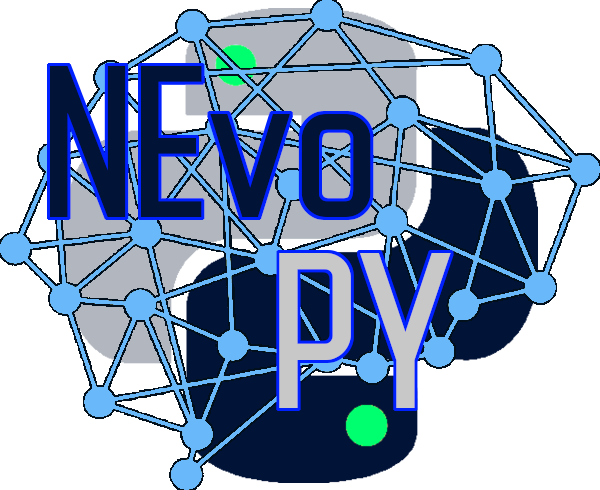
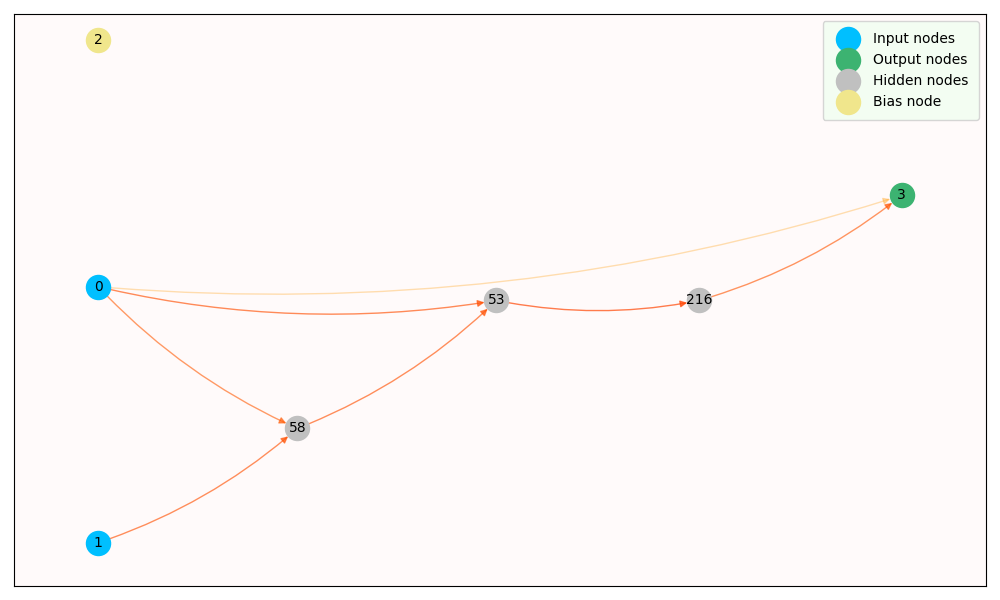

<h2> Neuroevolution for Python </h2>


*NEvoPY* is an open source neuroevolution framework for Python. It allows 
researchers and enthusiasts to quickly tackle machine learning problems 
through the use of neuroevolution algorithms. In addition to being highly 
optimized for distributed computing, *NEvoPY* is also compatible with
TensorFlow.

Currently, *NEvoPY* implements the NEAT (Neuro Evolution of Augmenting 
Topologies) algorithm and a custom fixed-topology deep-neuroevolution algorithm,
but much more is coming.

Here is sample neural nework generated by the NEAT algorithm to learn the XOR logic 
function:



<h2> Installing </h2>

To install the current release, use the following command:

```
$ pip install nevopy
```

<h2> Getting started </h2>

To get started with *NEvoPY*, please check out the examples available [here](https://github.com/Talendar/nevopy/tree/master/examples).

<h2> Citing </h2>

If you use *NEvoPY* in your research and would like to cite the *NEvoPY*
framework, here is a Bibtex entry you can use. It currently contains only the
name of the original author, but more names might be added as more people
contribute to the project. Also, feel free to contact me (Talendar/Gabriel) to
show me your work - I'd love to see it.

```
@misc{nevopy,
  title={ {NEvoPY}: A Neuroevolution Framework for Python},
  author={Gabriel Guedes Nogueira},
  howpublished={\url{https://github.com/Talendar/nevopy}},   
}
```
